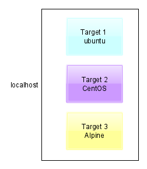

### Verification de l'environment 

Attendez que les containers soient installes

ATTENTION : SI VOUS AVEZ DEJA FAIT CES ETAPES ALLEZ AU STEP 3

On change ensuite de directory

```
cd ansible-course
```{{execute T1}}


et on execute la commande suivante pour verifier l'installation
```
ansible all -m ping -i inventory_local
```{{execute T1}}

C'est notre premiere commande Ansible qui se nomme Ad-Hoc command
*  *ansible*   c'est le nom du programme
*  *all*       correspond a tous les hosts precises dans le fichier d'inventaire inventory_katacoda 
*  *-m ping*   m pour module avec le nom du module c'est ici l'outil ping
*  *-i inventory_katacoda* soumet ce fichier d'inventaire a Ansible



Installation du  message of the day dans tous les hosts 
```
ansible-playbook -i inventory_local motd.yml
```{{execute T1}}