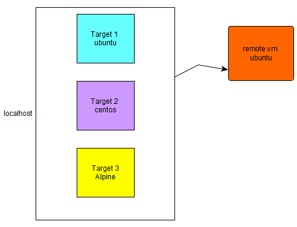

Wait until all containers are up and running 

Move to the github repo previously downloaded when starting this scenario
```
cd ansible-course
```{{execute T1}}

Create an ssh key, hit enter to accept all default and no passphrase 
```
ssh-keygen -t rsa -b 4096
```{{ execute T1 }}

Propagate this ssh key to the remote vm **don't miss changing this IP address** 
```
ssh-copy-id  ubuntu@175.155.22.22
```{{ copy }}

Check all containers IP address 
```
docker network inspect bridge
```{{ execute T1 }}

Modify the inventory, change the remote machine settings in inventory_local file   

and then we are going to enter the following ad-hoc command for checking whether our environment is ok.  
```
ansible all -m ping -i inventory_local
```{{execute T1}}

This is our command   
*  **ansible**             program name  
*  **all**                 select all hosts defined in the inventory file    
*  **-m ping**             -m is a switch saying we are using a certain module followed by its name  
*  **-i inventory_local** -i means inventory followed by the name of the inventory file.  




