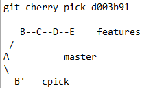

go to calc_other
```shell
cd ~ && cd calc_other
```{{ execute T1 }}

### check local branches
```
git branch
```{{execute T1}}

### create a local branch that tracks the remote features branch
```
git branch features origin/features
```{{execute T1}}

Verify what features are available for you to use 
```
git log --oneline features
```{{execute T1}}

Create a temporary branch to use as we work on incorporationg the features
Create a new branch cpick and switch to it
cpick here represents “cherry pick”)
```
git checkout -b cpick
```{{execute T1}}

check if there are no change
```
git status
```{{execute T1}}

if there is some change 
```
git stash
```{{execute T1}}

We want to pull in the max, exp , min function to add to your calculator , 
Start with the max function 
git cherry-pick usually brings a commit from somewhere else 
and applies it on top of your current branch, recording a new commit, 

```
git cherry-pick d003b91
```{{execute T1}}


                      
Check 
```
git log cpick --oneline
```{{ execute T1 }}

Graph , command acronym is a dog 
```
git log --all --decorate --oneline --graph 
```{{ execute T1 }}

