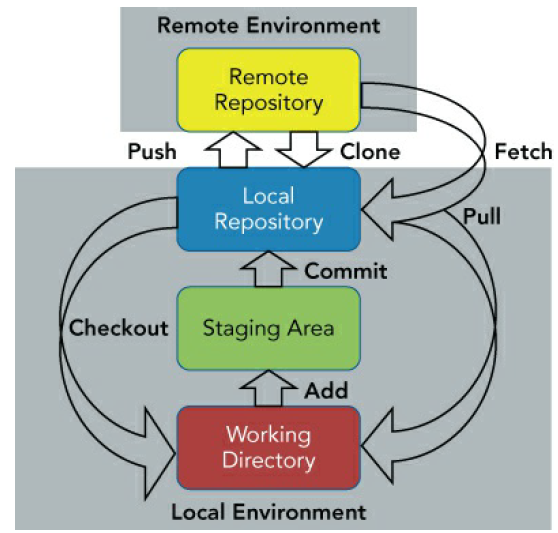

Enter a text in file test.py

```
echo "version 1" >> test.py
```{{execute T1}}

Add the file in workspace 
```
git add .
```{{execute T1}}

by committing the file, it moves to a staging area
```
git commit -m"first init"
```{{execute T1}}

check the git log file 
```
git log
```{{execute T1}}

display one line only
```
git log --oneline
```{{execute T1}}


You can see, the strange-looking name SHA1 is an acronym for Secure Hashing
Algorithm 1. In short, it's a checksum. It has its roots in the MD5
implementation if you're familiar with that.


